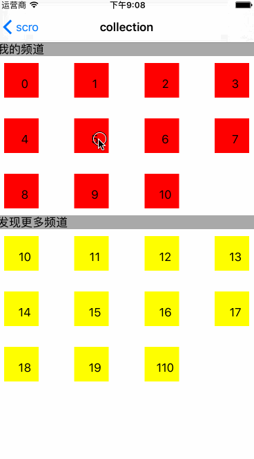

 

####reference:
1.[数据更新及列表书写规范](https://github.com/nshintio/uicollectionview-reordering/blob/master/Example/Example/FirstViewController.swift)

2.[collectionView重排功能](http://www.cocoachina.com/ios/20150914/13418.html)
([英文原版](http://nshint.io/blog/2015/07/16/uicollectionviews-now-have-easy-reordering/))

 [uicollectionview-reordering](https://github.com/nshintio/uicollectionview-reordering)

3.[官方文档](https://developer.apple.com/library/ios/documentation/WindowsViews/Conceptual/CollectionViewPGforIOS/CreatingCellsandViews/CreatingCellsandViews.html#//apple_ref/doc/uid/TP40012334-CH7-SW1)

4.相关问题处理

http://stackoverflow.com/questions/13698275/uicollectionview-moveitematindexpathtoindexpath-issues-moving-items-not-on-scr

http://stackoverflow.com/questions/19524468/uicollectionview-reorder-animation
